# micro:bitでブロック崩しゲーム
# 目的
micro:bitを使ってブロック崩しゲームを作る<br>
<mark>fixme</mark> 完成形を差し込む。1x1ブロックパターンと、2x2ブロックパターンの二個を用意。

# 内容目標
- micro:bitでブロック崩しゲームを作る
- micro:bitとはどういうものか、何ができるのかを理解する
- pythonにおける、リスト(配列)の概念を理解する
- 関数についてマスターする
# 目次

- [micro:bitとは](#microbitとは)
- [pythonとは](#pythonとは)
- [プログラム全体図](#プログラム全体図)
- [micro:bitの紹介](#microbitの紹介)
  - [LED表示](#LED表示)
  - [ボタン操作](#ボタン操作)
  - [様々なセンサ](#様々なセンサ)
- [LEDを点灯させてみよう！](#LEDを点灯させてみよう！)
# micro:bitとは
BBC micro:bitは、プログラミング可能な小さなコンピューターだ。<br>
学習や教育が楽しく簡単に出来るようにデザインされているよ[[1]](https://groklearning.com/)。<br>
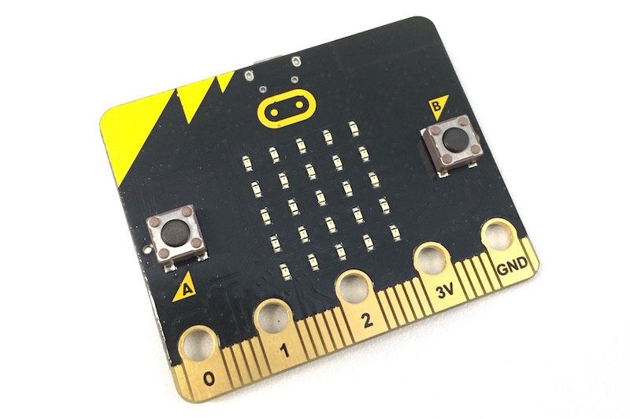

# pythonとは
Pythonは、迅速に開発を進め、システムを効果的に統合できるプログラミング言語です[[2]](https://www.python.org/)。<br>


# プログラム全体図
- ①初期位置にブロックを配置<br>
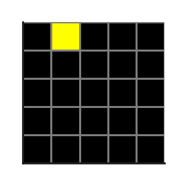

- ②一定時間経過でブロックが落下<br>


- ③一番下まで落ちたら、ブロックをそこに配置<br>


- ④新しいブロックを生成<br>
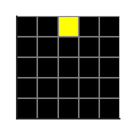

- ⑤一列揃ったらその列を消去<br>
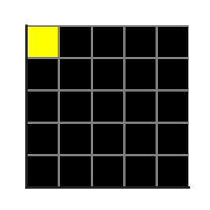

★★一旦完成★★

- Ex. プログラムを見やすくしよう
- Ex. 消したブロックより上のブロックを落とす
- Ex. 画面がチカチカしないようにする
- Ex. ブロックの種類を追加

Exは順不同。<br>
# micro:bitの紹介
## LED表示<br>
- 5×5のLEDディスプレイ（発光ダイオード）<br>
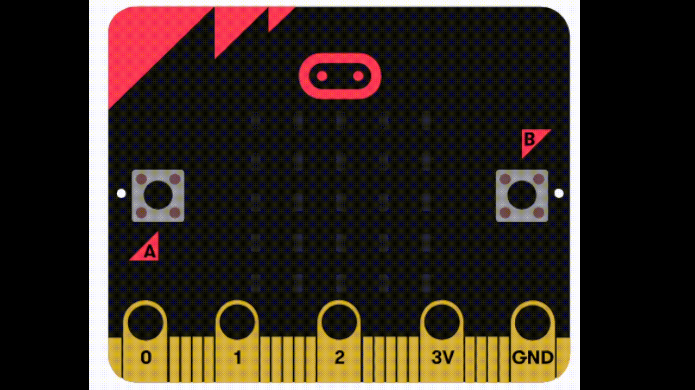

## ボタン操作<br>
- 2つのボタン（左Aボタン、右Bボタン）<br>
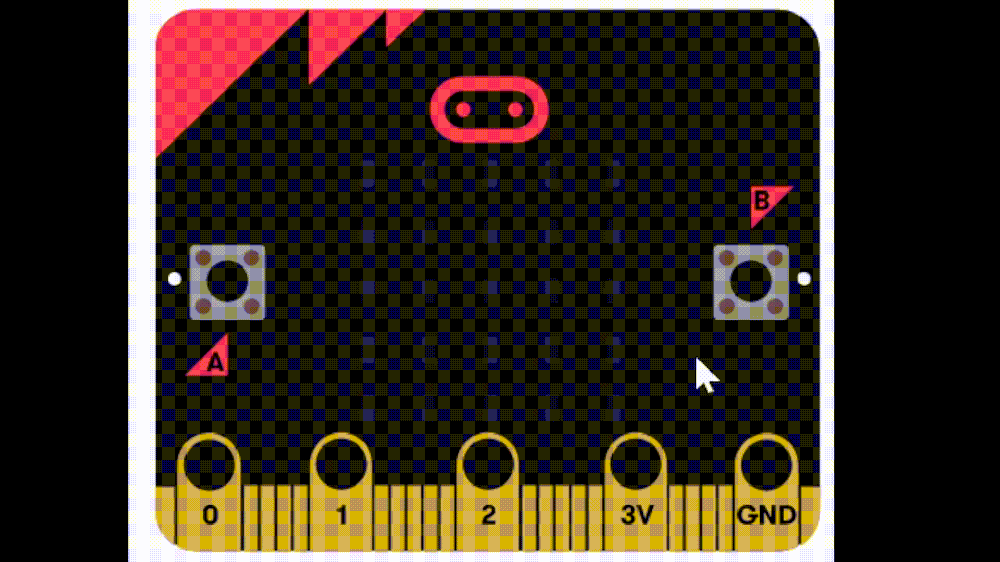

## 様々なセンサ<br>
- 加速度計<br>
- 磁力計（コンパス）<br>
- 温度センサー<br>
- Bluetooth<br>
- ラジオ通信（他のmicro:bitと通信する）<br>
- 外部入出力ピン（金色のパッド部分）<br>
# LEDを点灯させてみよう！(5min)
### 指定した場所のLEDを点灯<br>
```python: python
flash(x, y, 明るさ)
```
### (2, 2) の位置に明るさ9で点灯
```python: demo1.py
flash(2, 2, 9)
```
### micro:bitで実行
↓のコマンドを TERMINAL で実行する<br>
```bash: TERMINAL
uflash demo.py
```
↓のようにLEDが光れば成功！<br><br>
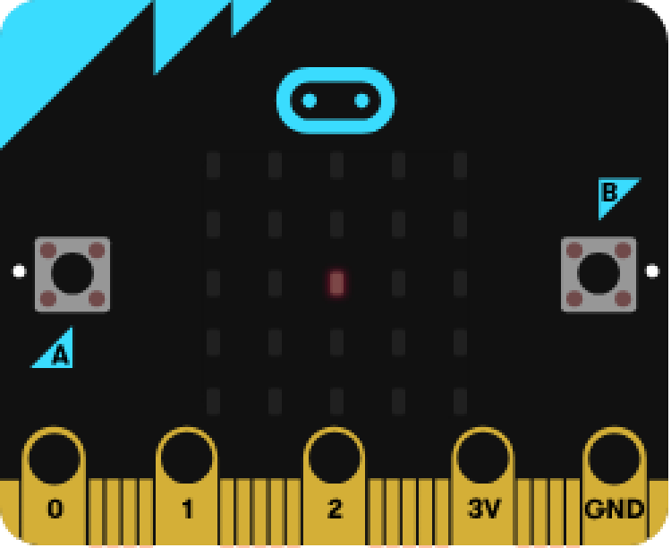

### x座標とy座標について<br>
- x: よこの位置 0（左）〜4（右）<br>
- y: たての位置 0（上）〜4（下）<br>
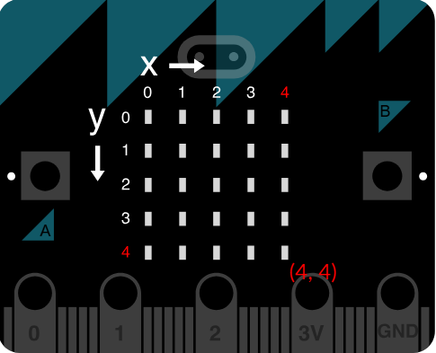

### 明るさについて<br>
- 0(真っ暗)〜9(一番明るい)<br>
### 関数について<br>
<mark>fixme</mark> 画像が欲しい<br>

### Work. (0, 4)の位置に明るさ6で点灯してみよう<br>
<ins>demo.py</ins>のプログラムを、(0, 4)の位置に明るさ6で点灯させるプログラムに書き換えてください。

↓の画像のように光れば成功!<br><br>
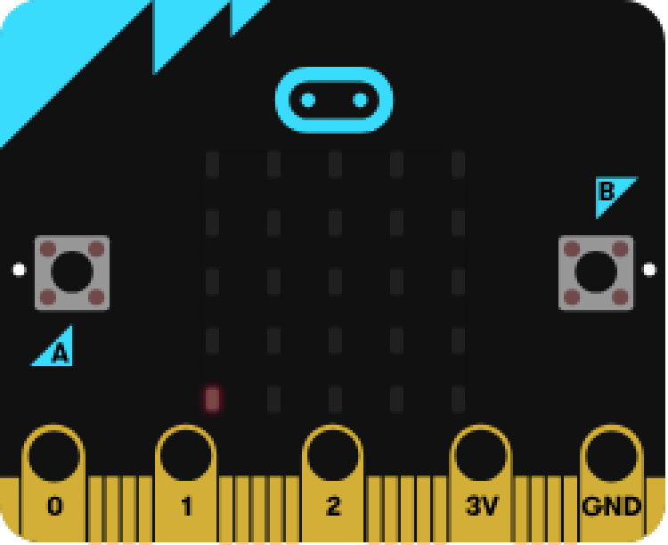

<details><summary>答え</summary>

```python:demo.py
flash(0, 4, 6)
```
</details>

### Work. 以下のプログラムを実行した時、どのLEDが光るかを考えてみてください<br>
```python:python
flash(2, 0, 9)
flash(2, 1, 9)
flash(2, 2, 9)
flash(2, 3, 9)
flash(2, 4, 9)
```


<details><summary>答え</summary>
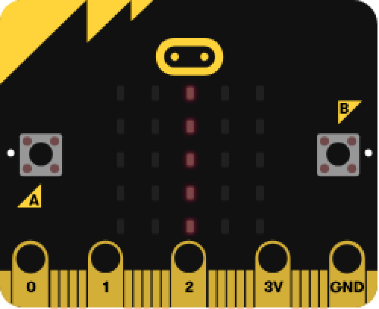
</details>

## Work①,②: 落ちるブロックを作ろう(10min)
ここでは、ブロックが一定時間ごとに落ちていくプログラムを作っていきます。<br>
↓完成形<br><br>
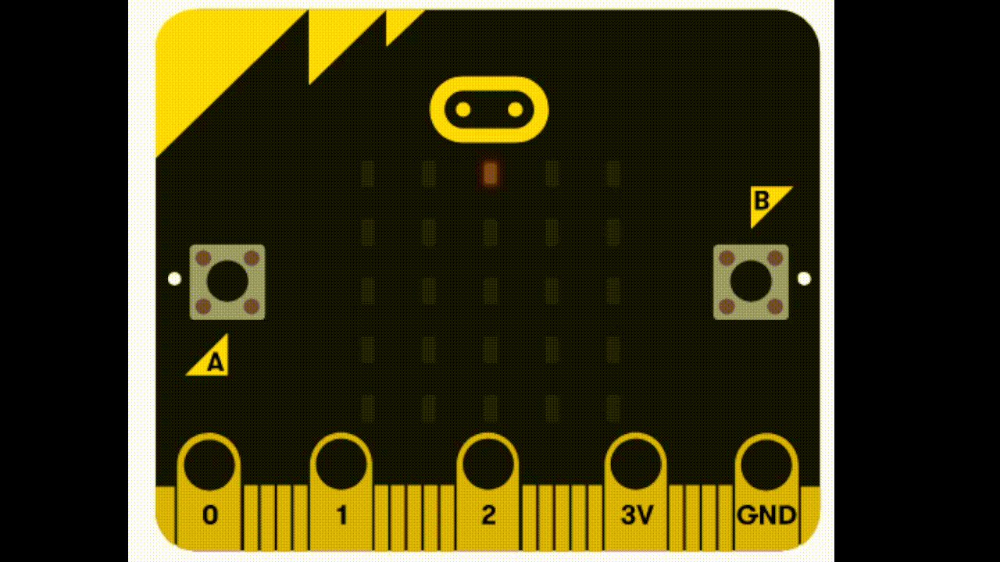

このために、<br>
#### ①初期位置(一番上の真ん中)にブロックを表示<br>
#### ②そのブロックを一定時間ごとに落とす<br>

という順番でプログラミングをしていきます！<br>

### ①初期位置にブロックを表示<br>
まずは、一番上の真ん中(x = 2, y = 0)の位置にLEDを点灯するプログラムを作っていきます。<br>
これが、ゲームを開始したときのブロックの初期位置になります。<br>

#### 1. main.pyを開く<br>
今までは練習のため、<ins>demo.py</ins>というファイルにプログラムを書いていました。<br>
ここからは実際にブロック崩しゲームを作っていくので、本番用のファイル(<ins>main.py</ins>)を開いてください。<br>
ここからは、プログラムはこの<ins>main.py</ins>に記述していきます。<br>

#### 2. 座標を変数で指定できるようにする<br>
これまではflashの引数には直接数字を入れていました(ex. flash(2, 2, 6))。<br>
しかし、今後のために、LEDを点灯する座標は変数で指定できるようにしておきましょう。<br>
なので、x と y という変数を作成し、初期値を代入してください。<br>
初期値は、一番上の真ん中の位置に表示できるような値にしてください。<br>
<details><summary>答え</summary>

```python:demo.py
x = 2
y = 0
```
</details>

その後、(x,y)の位置に、明るさ9で点灯するプログラムを作成してください<br>

<details><summary>答え</summary>

```python:demo.py
x = 2
y = 0
flash(x, y, 9)
```
</details>

#### 3. 繰り返し処理

現時点のプログラムは、**(x, y)を指定し、その座標のLEDを明るさ9で点灯させる**というものです。

このプログラムでは、**LEDを一回光らせたらプログラムが終了**しています。<br>
点灯し続けているので**繰り返している**と錯覚するかもしれませんが、 PC から電源が供給され続けているので光っているだけです。<br>
一定時間経過ごとにブロックを落とすためにはプログラムは**終了してほしくない**ので、**繰り返し処理**を追加します<br>
pythonには**二種類**の繰り返し(ループ)があったのを覚えていますか？<br>
<details><summary>答え</summary>

**for(回数ループ)**
```python:demo.py
for i in range(10):
```
**while(条件ループ)**
```python:demo.py
while 条件式:
```
</details>

ブロック崩しゲームの場合、どちらのループを使う方が良いでしょうか？
<details><summary>答え</summary>

一般的には、ゲームが終了するまで何回ループをするかは分からない(時と場合による)ので、本レッスンでは while を使います。<br>
ゲームの終了条件を今の進捗で入れるのは難しいので、とりあえず無限ループにしましょう。<br>
**while(無限)**
```python:demo.py
x = 2
y = 0
while True:
  flash(x, y, 9)
```
</details>

これで繰り返し処理の実装も完了しました。<br>
- 実行して確認
```bash:TERMINAL
uflash main.py
```
micro:bitをパソコンに繋げて、上記のコマンドを実行してみてください。<br>
↓のように初期位置が光っていたら成功です！<br>
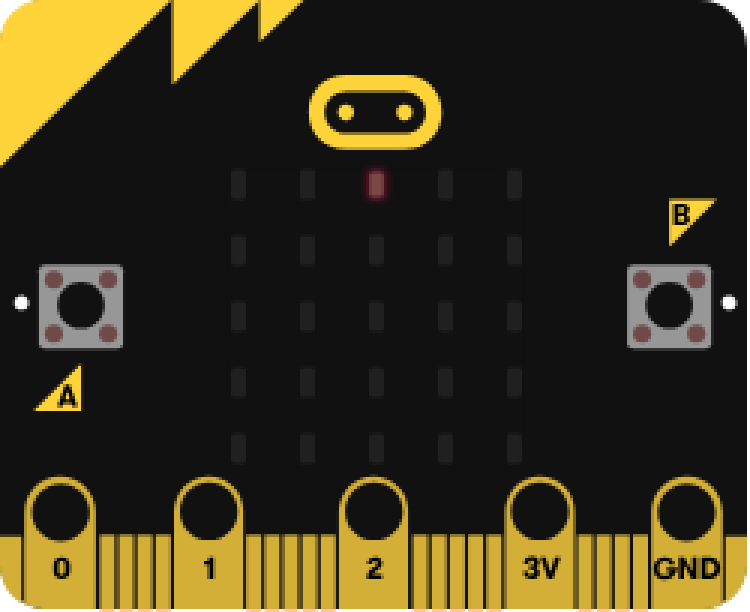


### ②ブロックが落下するようにする
準備が整ったので、いよいよ本題の**落下するプログラム**を書いていきます！<br>
#### 1. フローチャート
現時点のプログラムは、**同じ場所のLEDを点灯し続ける**プログラムです。<br>
フローチャートは以下になります。<br>
```
(2, 0)の位置のLEDを点灯
↓
(2, 0)の位置のLEDを点灯
↓
(2, 0)の位置のLEDを点灯
↓
(2, 0)の位置のLEDを点灯
↓
...
```
落ちているように見せるためには、フローチャートは以下である必要があります。<br>
```
(2, 0)の位置のLEDを点灯
↓
(2, 1)の位置のLEDを点灯
↓
(2, 2)の位置のLEDを点灯
↓
(2, 3)の位置のLEDを点灯
↓
...
```
つまり、yの座標を1ずつ増やしていけばいいわけです。<br>
これを見据えて、上記ではyの変数化を行いました。<br>
プログラムのフローチャートを詳しく書くと、以下になります。<br>
```
xに2を、yに0を代入
↓
(x, y)の位置のLEDを点灯
↓
yの数字を+1する
↓
(x, y)の位置のLEDを点灯
↓
yの数字を+1する
↓
(x, y)の位置のLEDを点灯
↓
yの数字を+1する
↓
...
```
となるようにプログラムを変更すればよさそうですね。<br>
#### 2. フローチャートを基にプログラム作成
上記のフローチャートを参考にしながら、落下するプログラムを自力で作ってみてください。<br>
<details><summary>(とりあえずの)答え</summary>

```python:demo.py
x = 2
y = 0
while True:
  flash(x, y, 9)
  y += 1(もしくは、 y = y + 1)
```
フローチャート通りに素直に書くと、こうなるはずです。<br>

#### クイズ
上記のプログラムを実行すると、↓のように一瞬で一列が光るはずです。なぜでしょうか？<br>


<details><summary>答え</summary>

少し前に下記のようなクイズをしたのを覚えていますか？<br>
### Work. 以下のプログラムを実行した時、どのLEDが光るかを考えてみてください<br>
```python:python
flash(2, 0, 9)
flash(2, 1, 9)
flash(2, 2, 9)
flash(2, 3, 9)
flash(2, 4, 9)
```


この時に、flash関数は、指定した座標を光らせる(だけ)の関数だと説明しました。<br>
つまり、LEDを消すためには、LEDを消す関数(clear)を使わなければいけません。<br>
ということは、上記で考えたフローチャートが間違っていたというわけです。間違っていたというよりも、見積りが甘かったという方が適切かもしれません。<br>
```
(2,0)を点灯
↓
LEDを消す
↓
(2,1)を点灯
↓
LEDを消す
↓
(2,2)を点灯
↓
...
```
となればいいので、
```python
flash(2, 0, 9)
clear()
flash(2, 1, 9)
clear()
flash(2, 2, 9)
clear()
flash(2, 3, 9)
clear()
flash(2, 4, 9)
```
という風に、flash関数の間にclear関数を挟んであげればよさそうです。<br>
しかし、実行すると↓のように、一番下だけが点灯します。なぜでしょうか？<br>
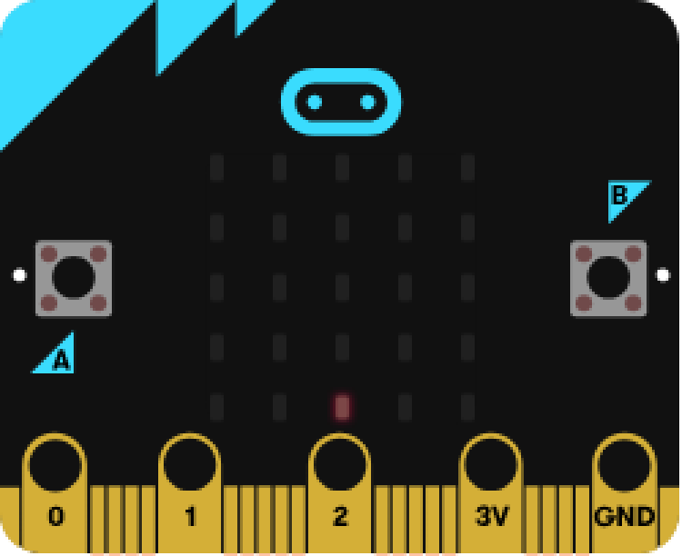

<details><summary>答え</summary>

**プログラムはあっています。**<br>
しかし、**プログラムは一行0.05秒ぐらいで処理される**ので、**一瞬で一番下まで行ってしまった**ということです。<br>
ただし、これだと動きが速すぎて目で追えないので、**少し待機してもらいましょう**。<br>
待機する関数は、**sleep**です。引数の単位は秒ではなく**ミリ秒**(秒/1000)なので気を付けてください。
```
(2,0)を点灯
↓
0.5秒待機
↓
LEDを消す
↓
(2,1)を点灯
↓
0.5秒待機
↓
LEDを消す
↓
(2,2)を点灯
↓
0.5秒待機
↓
...
```
となればいいので、
```python
flash(2, 0, 9)
sleep(500)
clear()
flash(2, 1, 9)
sleep(500)
clear()
flash(2, 2, 9)
sleep(500)
clear()
flash(2, 3, 9)
sleep(500)
clear()
flash(2, 4, 9)
```
このプログラムを実行すると、↓のように期待通りに動いてくれます。


上記のプログラムを参考にして、<ins>main.py</ins>のプログラムを修正していきましょう！<br>
</details>
</details>
</details>

#### 3. フローチャートの修正
上記で、先ほど作ったフローチャートに二つミスがあることが発覚しました。<br>
- 消灯する処理が抜けていた<br>
- 待機する処理が抜けていた<br>

#### Ex. プログラミングの面白さ
皆さんはプログラムが間違っていたりエラーが出たりすると失敗したと思って落ち込むかもしれません。<br>
しかし、これからは間違っていたりエラーが出たりしたときは**喜んで**ください。<br>
プログラミングの一番の醍醐味は、(私の意見では)トライ&エラーです。<br>
少し考えただけでは一発でうまくいかないような難題を、何が足りていないか、どういう機能を追加したらよいか、もっと改善する方法はないか…と考え挑戦することで、立派な作品を作ることができます。<br>
これは難しい作品であればあるほど、完成したときの喜びは大きいです。<br>
作品の難しさは、間違った回数やエラーが出た回数だと思っています<br>
つまり、間違っていたりエラーが出たりすればするほど完成したときの喜びが大きくなっていくのです。<br>
なので、プログラムが間違っていたりエラーが出たりしても笑顔で、その原因を一つずつつぶしていきましょう。<br>

#### 3. フローチャートの修正
話が脱線しましたが、フローチャートの修正を行っていきます。<br>
修正すべきポイントは、以下の２点でした。<br>
- 消灯する処理を追加する<br>
- 待機する処理を追加する<br>

今回は２つ一気に修正できそうです。修正したフローチャートは以下です。<br>
```
xに2を、yに0を代入               xに2を、yに0を代入
↓                               ↓
(x, y)の位置のLEDを点灯          (x, y)の位置のLEDを点灯
|                                ↓
|                                0.5秒待つ
|                                ↓
|                                clear()
↓                               ↓
yの数字を+1する                  yの数字を+1する
↓                               ↓
(x, y)の位置のLEDを点灯     →   (x, y)の位置のLEDを点灯
|                                ↓
|                                0.5秒待つ
|                                ↓
|                                clear()
↓                               ↓
yの数字を+1する                  yの数字を+1する
↓
...
```
このフローチャート通りにプログラムを書けば、落ちるプログラムが完成します！やってみましょう！<br>
- 0.5秒待つ: sleep(500)
- clear(): clear()
<details><summary>答え</summary>

```python:demo.py
x = 2
y = 0
while True:
  flash(x, y, 9)
  sleep(500)
  clear()
  y += 1
```
</details>
現時点でのプログラムでは、ブロックが一番下に行った後、変なマークが表示されていると思います。<br>
この変なマークはエラーのサインです。<br>
何故エラーが出ているか分かりますか？<br>
<details><summary>答え</summary>

存在しない場所のLEDを点灯しようとして、"そんなところにLEDは無いよ"というエラーが出ています。<br>
では、どのようにプログラムを変更すればエラーが出なくなるでしょうか？<br>
<details><summary>答え</summary>

エラーが出ないようにするためには、yの数字を4より大きくしないように修正すればできそうです。<br>
今、yの数値を変更(インクリメント)している所は、 y += 1 の所なので、そこを修正しましょう。<br>
現状だと、"無条件で+1する"プログラムになっていますが、"yの数値が4より小さい時だけ+1する"プログラムに変更しましょう。<br>
プログラム的に言えば、"yの数値が4より小さければ+1、でなければ何もしない"というプログラムに変更します。<br>
このようなプログラムを書きたい時は条件分岐を使えばいいので、<br>
```python:demo.py
x = 2
y = 0
while True:
  flash(x, y, 9)
  sleep(500)
  clear()
  if y < 4:
    y += 1
```
というプログラムに変更すれば、エラーが出なくなるはずです。<br>
</details>
</details>

## Work③: 着地したブロックを記録しよう(20min)
現時点でのプログラムでは、ブロックが一番下に行くと、その場で止まるという動きになっています。<br>
完成に近づけるためには、<br>
①一番下に落ちたらその場所にブロックを固定し<br>
②そのブロックの座標をどこかに保存して<br>
③次のブロックを出す<br>
ように変更する必要があります。<br>
まず、一番下に落ちたブロックの座標を保存するプログラム、次に保存した座標を常に光らせるプログラム、最後に次のブロックを出すプログラムを書くという順番で実装していきます！<br>
### Step1: ブロックの座標を保存する方法を考えよう
まずは、一番下に落ちたブロックの座標を保存するプログラムを書いていきましょう！<br>
何かを保存したい時に使うものと言えば、変数を思い浮かべると思います。<br>
しかし、変数には弱点があって、一つの変数につき1つの値しか保存できません。<br>
今回は、LEDは 5 x 5 の25個あり、25個変数を作るのはめんどくさいですし、何よりプログラムがぐちゃぐちゃになり読みにくく(可読性が低く)なってしまいます。<br>
そこで、今回はリスト(配列)というものを使って、一つのリストに25個の情報を一気に入れようと思います。

### リスト(配列とは)
リストと配列は厳密には違うけど、同じものだと思ってくれて大丈夫です。気になる人はまた聞きに来てください。<br>
イノベーターネクスト・マスター終了生の人はリスト(配列)は知っていると思いますが、復習も兼ねてリスト(配列)とは何かを説明します。<br>
プログラムの<mark>fixme</mark>行目に、
```python:demo.py
blocks = [
  [0, 0, 0, 0, 0],  # y=0
  [0, 0, 0, 0, 0],  # y=1
  [0, 0, 0, 0, 0],  # y=2
  [0, 0, 0, 0, 0],  # y=3
  [0, 0, 0, 0, 0],  # y=4
  [1, 1, 1, 1, 1],  # 地面
]
```
というプログラムが書いてあると思います。(書かれてないぞっていう人は手を挙げて教えてください。)<br>
これがリストになっていて、点灯したいLEDの所の数値を1に変えると、LEDが点灯します。<br>
好きな所の数値を1に変えて、実行してみてください。<br>
ただし、リストのLEDを点灯させるためには、専用の関数を実行しないといけないので、プログラムを以下に変更してください。<br>
```python:main.py
blocks[2][2] = 1
flashm(blocks)
x = 2
y = 0
while True:
  flash(x, y, 9)
  sleep(500)
  clear()
  if y < 4:
    y += 1
```
リストは変数と同じように、プログラムの中でも数値を変えることができます。<br>
上記は(2,2)の座標のLEDを点灯させるプログラムでしたが、
```python:main.py
blocks[0][0] = 1
blocks[1][1] = 1
blocks[2][2] = 1
blocks[3][3] = 1
blocks[4][4] = 1
flashm(blocks)
x = 2
y = 0
while True:
  flash(x, y, 9)
  sleep(500)
  clear()
  if y < 4:
    y += 1
```
とすると、斜めのLEDを点灯させることができます。<br>
これを使えば、一番下に落ちたブロックの位置を記録し、点灯させることができそうです！<br>
### Step2: 一番下に落ちたブロックの座標を保存しよう
現状のプログラムの中でブロックの落下の部分は、<br>
"yの数値が4より小さければ+1、でなければ何もしない"<br>
になっています。<br>
これを、<br>
"ブロックの一個下の座標が地面ならば今の座標を保存して新しいブロックを作り、でなければyを+1する(落下する)"<br>
に変更すればよさそうです。<br>
まずは、現状のif文の条件式を、<br>
"yの数値が4より小さければ"<br>
↓<br>
"ブロックの一個下の座標が地面ならば"<br>
に変えましょう。<br>
<details><summary>答え</summary>

ブロックの一個下の座標というのは、プログラムでいうと (x, y+1) に当たります。<br>
ブロックの真下が地面ならば、 リストの(x, y+1)は1になっているはずです。<br>
つまり、"ブロックの一個下の座標が地面ならば"というプログラムは以下になります。<br>
```python
if blocks[x][y + 1] == 1:
```
"ブロックの一個下の座標が地面ならば今の座標を保存して新しいブロックを作る"というプログラムは以下になります。<br>
```python
if blocks[x][y + 1] == 1:
  blocks[x][y] = 1
  y = 0
```
今の座標は、(x, y)です。新しいブロックを作るには、yを0にしてあげれば"新しいブロックをあたかも作ったかのような挙動"になります。<br>
このままでは落下する部分が無いので、"一個下が地面でなければ落下する"というプログラムを追加しましょう。<br>
```python
if blocks[x][y + 1] == 1:
  blocks[x][y] = 1
  y = 0
else:
  y += 1
```
思ったよりも簡単ではないですか？<br>
思った通りに動いているかどうか、実行してみて試してみてください。<br>
プログラミングでは、結果的に正しい動きをしていれば、正解になります。

皆さんは"一番下に落ちたらブロックの座標を保存して、そこを常に光らせ、新しいブロックを出す"というプログラムを書いた自覚がないかもしれませんが、実際にはその通りの動きになっているので、"一番下に落ちたらブロックの座標を保存して、そこを常に光らせ、新しいブロックを出す"というプログラムを書いたことになります。

これで、一番難関(だと思われる)プログラムが完成しました。
</details>

## A/Bボタンでブロックを左右に動かそう
これまでかなりのトライ&エラーを繰り返し、かなりの量のプログラムを書いてきたと思います。<br>
ただ、現状だと<br>
ブロックが上から降ってきて、どんどん積みあがっているプログラム<br>
になっており、全然ゲーム感がありません。ゲームを作るのは結構大変なんです。<br>
この調子で完成まで作っていくと、到底90分ではできないので、ここからは駆け足気味で行きます。<br>
まずは、ブロックを左右に移動できるようにしていきましょう。<br>
Aボタンを押せばブロックが左に移動し、Bボタンを押せばブロックが右に移動するプログラムを書いていきます<br>
これを実装するためには条件分岐を使えばよさそうです。<br>
条件分岐を覚えていますか？<br>
<details><summary>条件分岐</summary>

**if文**
```python:demo.py
if 条件式:
  処理①
```

</details>

Aボタンを押せばブロックが左に移動するというプログラムは、以下になります。<br>
```python
if button_a.was_pressed() and x > 0:
        x -= 1
        clear()
```
button_a.was_pressed()という関数は、Aボタンを押すとTrue、それ以外の時はFalseが返ってきます<br>
andより右の部分は、場外に出ないようにするための条件式です。<br>
clear()をしているのは、移動した後に前にいた部分を消すためです。

これを参考にして、ボタンBのプログラムも自力で書いてみてください!<br>

<details><summary>答え</summary>

**if文**
```python:demo.py
# === ここから書いてOK ===
x = 2
y = 0
while True:
  flashm(blocks)
  flash(x, y, 9)
  sleep(500)
  y += 1
  if button_a.was_pressed() and x > 0:
        x -= 1
        clear()
  if button_b.was_pressed() and x < 4:
        x += 1
        clear()
```

</details>
これで左右に移動するプログラムが完成しました！動かしてみましょう！<br>
...と言いたいところですが、このプログラムを実行しても左右には動いてくれません。なぜでしょうか？<br>

<details><summary>答え</summary>

現状のプログラムのループの中身は、以下になっています<br>

```
LEDを光らせる
↓
1秒待つ
↓
Aが押されてたらブロックを左に移動する
↓
Bが押されてたらブロックを右に移動する
↓
...
```

1秒待機している間は、ボタンが押されているかどうかは調べてくれません。<br>
なので、プログラムを以下のように変更します。<br>
```python:main.py
# === ここから書いてOK ===
x = 2
y = 0
timer = 0
while True:
  flashm(blocks)
  flash(x, y, 9)
  timer += 1
  if timer % 1000 == 0:
    clear()
    y += 1
    if blocks[y][x] != 0:
       blocks[y-1][x] = 1
       y = 0   
  if button_a.was_pressed() and x > 0:
        x -= 1
        clear()
  if button_b.was_pressed() and x < 4:
        x += 1
        clear()
```
具体的には、<br>
待機処理→タイマー処理<br>
に置き換えることで、常にボタンの判定をしてくれるようにしました。<br>
<mark>fixme</mark> タイマー処理と待機処理のフローチャートを、比較形式で貼る。通常のフローチャートではなく、上部に変数の値も載せること。
x:           x:         x:
y:
xに-を代入→yに-を代入→LED点灯
みたいな感じ。

</details>

これで少し早足ですが、左右に動くプログラムが完成しました！<br>

## 一列揃ったら消そう(15min)
さて、いよいよ最後のステップです。<br>
ここでは、ブロックが一列揃ったら消えるようにしていきます<br>
一番難しいと思うかもしれませんが、今回はリストを使っているので案外簡単に実装できます。<br>
### 一列揃ったら消すプログラムを書こう
いきなりですが、以下のプログラムを追加してください。
```python:main.py
    for i in range(5):
     flag = 0
     for j in range(5):
        if blocks[i][j] == 0:
           flag = 1
     if flag == 0:
        for j in range(5):
           blocks[i][j] = 0
```
これで一列揃ったら消えるプログラムの完成です。<br>
難しいプログラムに見えるかもしれませんが、一行ずつ見ると、全て知っているプログラムだと思います。<br>
アイデアとしては、<br>
一列ずつ、光っているかを確認(1なら光っている、2なら光っていない)し、全て1ならその列を消す<br>
というプログラムになっています。<br>
forループは、このようにリストと一緒に使うことが多いです。<br>

## Ex1 プログラムを見やすくしよう
現状のプログラムはぐちゃぐちゃで見にくいです。<br>
プログラムの可読性を上げるために、関数を定義して処理を部分ごとに分けましょう<br>
関数への分け方は自由にやってもらって構いませんが、私がやるなら<br>
①落下する処理の関数<br>
②左右に移動するかどうかの処理の関数<br>
の二つに分けます。<br>
別に今のままで正しく動いているんだからこのままでいいじゃないかという気持ちは痛いほどわかるのですが、未来の自分のためにも、このコードを読むかもしれない人のためにもコードの可読性を上げることを売すゝめします。<br>
可読性を上げることで、エラーの個所が特定しやすくなったり、プログラムを書く間隔が一週間以上空いたときでもスムーズに作業を再開できるようになります<br>
## Ex2 画面がチカチカしないようにしよう
分からなければ聞いてください。
## Ex3 一列消したらブロックが降ってくるようにしよう
分からなければ聞いてください。
## Ex4 ブロックの種類を追加
当たり判定の処理が結構複雑かもしれません。<br>
分からなければ聞いてください。<br>

## まとめ
ブロック崩しゲーム制作お疲れさまでした。<br>
90分という短い時間でしたが、大量のプログラムを書き、大量の試行錯誤をしたので結構疲れたと思います。<br>
ここまでやり切った皆さんは、pythonのプログラミング能力は飛躍的に向上しているので、今日学んだことを参考にしながら、これからも様々なプログラムを楽しみながら書いていってください。<br>

## 補足
もっといろんなプログラムを書きたいという人は、「最短距離でゼロからしっかり学ぶPython入門 必修編・実践編」という本がおすすめなので、この本を読んでみることをお勧めします。<br>

## 参考文献
[1] https://groklearning.com/<br>
[2] https://www.python.org/<br>
[3] https://microbit.org/ja/<br>
[4] https://microbit-micropython.readthedocs.io/en/v2-docs/<br>
[5] https://microbit-micropython.readthedocs.io/ja/latest/<br>
[6] Eric MAtthes. "Python Crash Course, 3rd Edition: A Hands-On, Project-Based Introduction to Programming". No Starch Press Inc.<br>


**Acknowledgement**  
This material was reviewed and refined with the assistance of ChatGPT (OpenAI).

Kazuma Aoyama(bloodtune65@gmail.com)